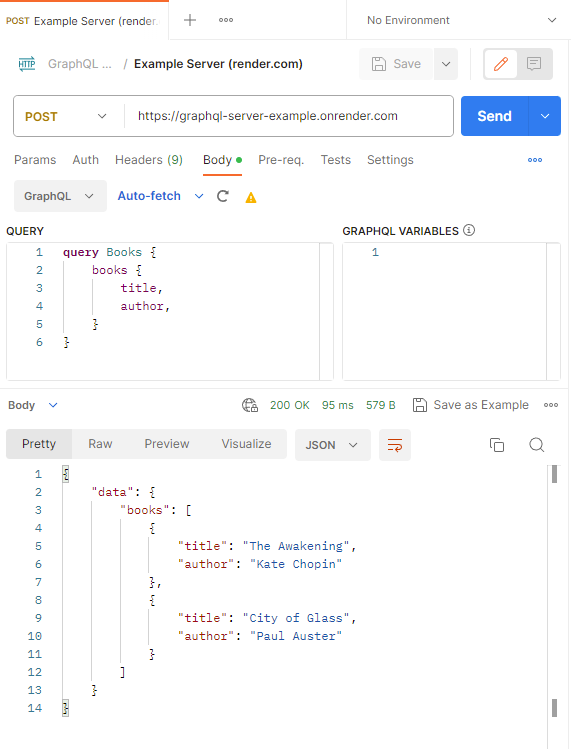

# GraphQL Server Example

This example GraphQL Server (Apollo v4) is currently hosted on: https://graphql-server-example.onrender.com/

You can send a POST request to it on Postman, with request body 
``` graphQL
query Books {
    books {
        title,
        author,
    }
}
```



## Alternatively, to run the GraphQL server locally:

```
npm start
```

