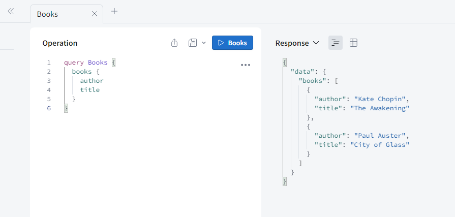

# GraphQL Server Example

This example GraphQL Server (Apollo v4) is currently hosted on: https://graphql-server-example.onrender.com/

with example request:
``` graphQL
query Books {
    books {
        author,
        title,
    }
}
```



## Alternatively, query the server via Postman

You can send a **POST** request to `https://graphql-server-example.onrender.com/` on Postman, with request body 
``` graphQL
query Books {
    books {
        title,
        author,
    }
}
```


## Alternatively, to run the GraphQL server locally:

```
npm start
```

and then query the GraphQL server either directly on http://localhost:4000, or via Postman